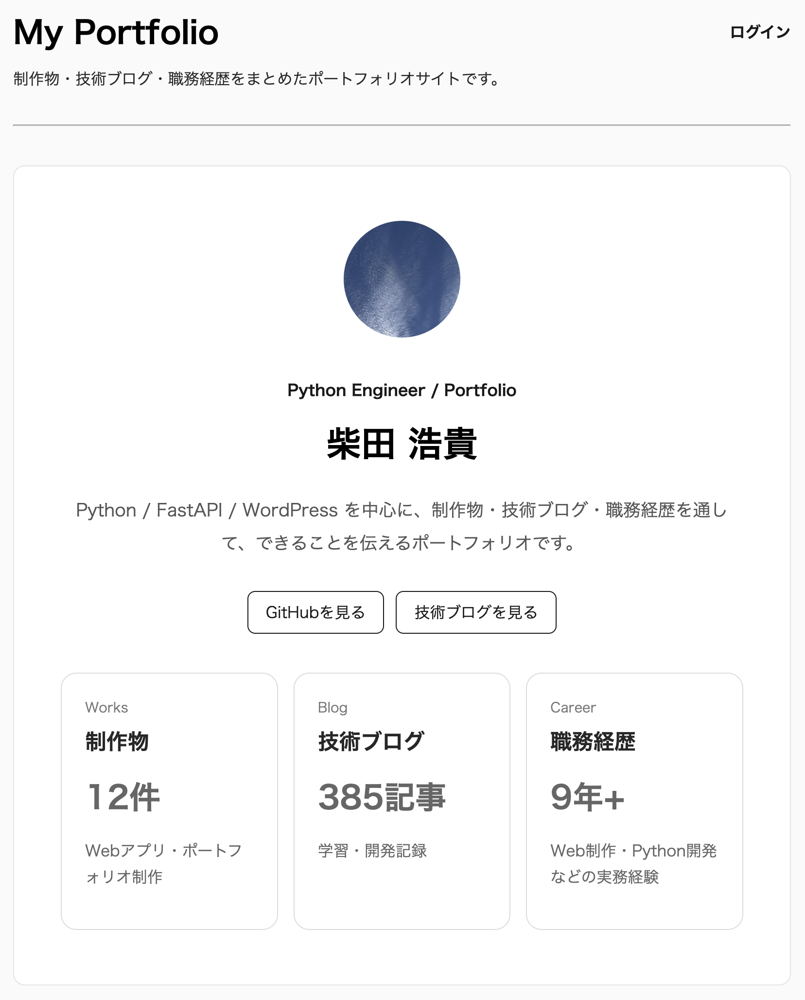
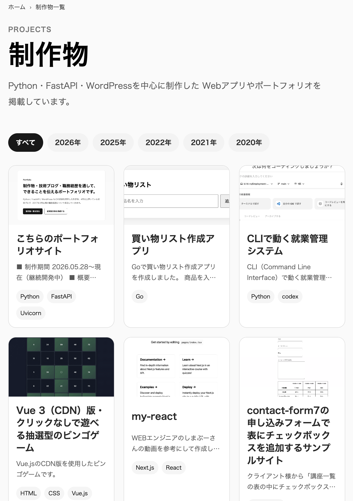
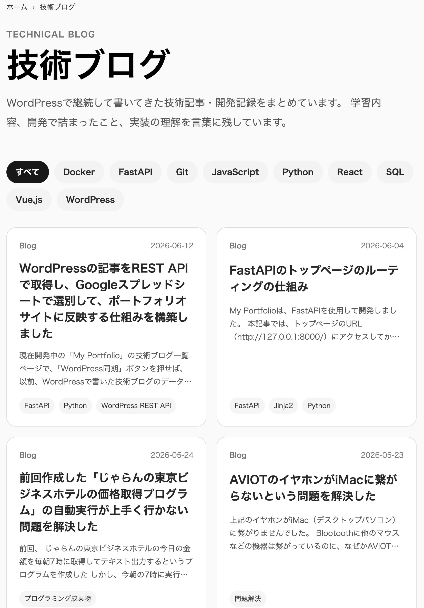
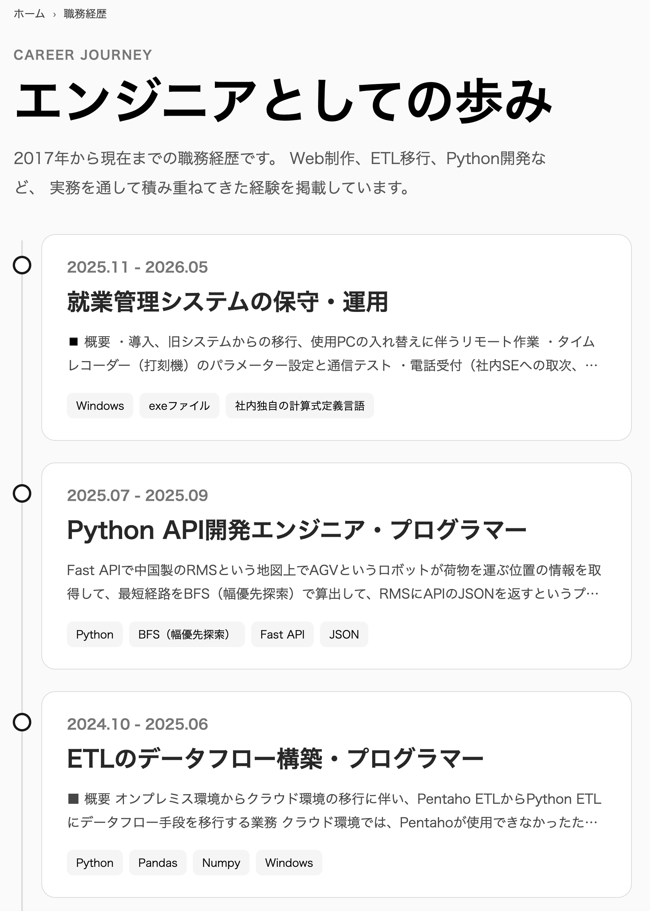
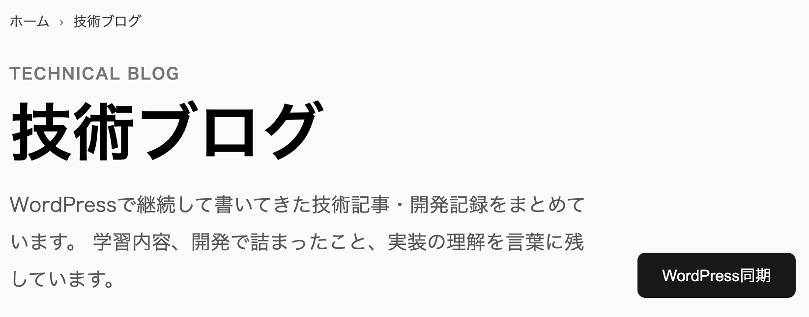

# My Portfolio

制作物・技術ブログ・職務経歴を一元管理する
ポートフォリオサイトです。

## URL

[https://freelance-blog.onrender.com/](https://freelance-blog.onrender.com/)

## 制作期間

2026.05.28〜現在（継続開発中）

## 使用技術

- Python
- FastAPI
- SQLAlchemy
- SQLite
- Jinja2
- Docker
- WordPress REST API

## 概要

FastAPIを用いて開発したポートフォリオサイトです。

制作物管理
技術ブログ管理
職務経歴管理

の3機能を実装しています。

またWordPress上の約1500記事を
REST API経由で取得し、
ポートフォリオへ自動同期する仕組みを構築しました。

## 主な機能

- ログイン機能
- 制作物管理（CRUD）
- 技術ブログ管理（CRUD）
- 職務経歴管理（CRUD）
- WordPress REST API連携
- タグ検索
- ページネーション
- レスポンシブ対応

## 画面

## 開発履歴

### 2026.05.28

FastAPI・SQLAlchemyを用いたポートフォリオサイトの開発を開始。
記事管理API（CRUD）、DB接続、Router分割など基盤機能を実装。

### 2026.05.30

制作物（Works）のCRUD機能を実装。
制作物詳細ページ、技術タグ、サムネイル表示、総作業時間集計、開発ログとの関連付け機能を追加。

### 2026.05.31

ログイン機能を実装。
管理者のみコンテンツを登録・編集できる仕組みを構築。

### 2026.06.02

技術ブログ（Blogs）のCRUD機能を実装。
ブログ一覧・詳細ページ、ページネーション機能を追加。

### 2026.06.02

職務経歴（Career）のCRUD機能を実装。
職務経歴一覧・詳細ページを追加し、ポートフォリオ内で一元管理できるようにした。

### 2026.06.03

Renderへデプロイ。
本番環境向けの設定調整および不具合修正を実施。

### 2026.06.11

WordPress REST APIを利用した記事同期機能を実装。
約1,500件の技術記事をポートフォリオサイトへ自動取り込みできる仕組みを構築。

### 2026.06.14

制作物のソート機能および技術ブログのタグ分類機能を実装。
コンテンツの検索性と閲覧性を向上。

## ローカル環境の起動方法

./venv/bin/python -m uvicorn app.main:app --reload